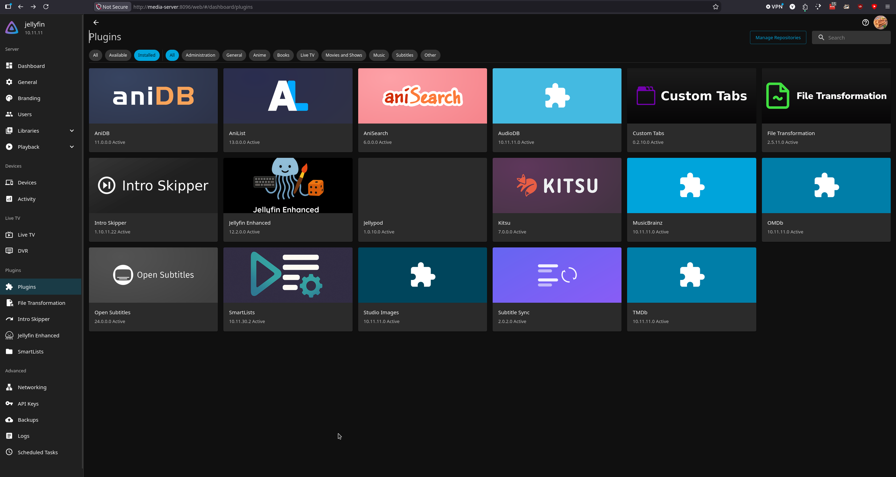

# Used plugins for jellyfin from post here:

https://www.reddit.com/r/jellyfin/comments/1rbswf1/must_have_plugins_of_2026/

Some plugins may be conflicting current list is :

# connect server to internet

https://www.youtube.com/watch?v=t7pNRmvy1BQ

Used media server setup with duck dns instead of cloudflare

# Notes

Why proxy wont work for audiobookshelf, need to set ip.