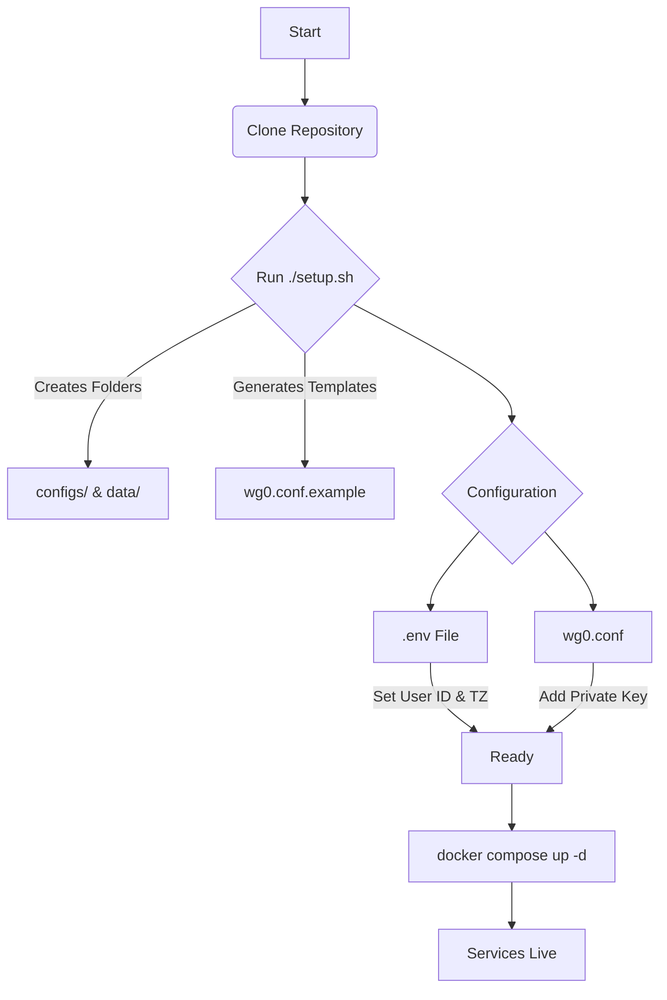
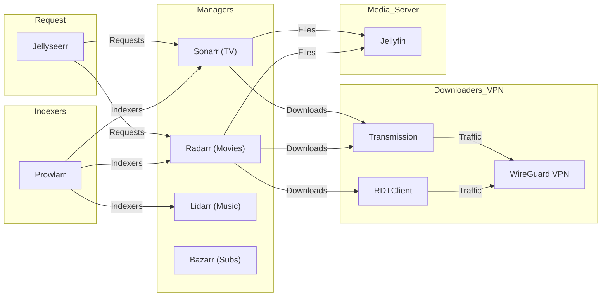
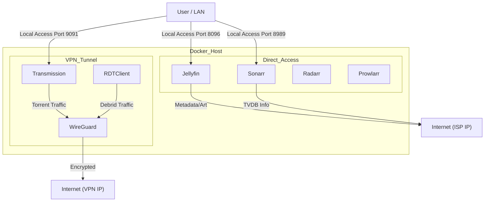

# Media Server Template

A complete, containerized media server stack using Docker Compose. This setup routes download clients (Transmission, RDTClient) through a WireGuard VPN while keeping other services accessible on your local network.

## Features

- **Media Server**: Jellyfin
- **the *Arrs**: Sonarr, Radarr, Lidarr, Bazarr, Prowlarr
- **Downloaders**: Transmission & RDTClient (VPN Enforced)
- **Requests**: Jellyseerr
- **Utilities**: Portainer, FlareSolverr, Podgrab
- **VPN**: WireGuard (Client Mode) with split tunneling for local access

## Architecture & Workflow

### 1. Installation Workflow


### 2. Service Dependencies (The "Arr" Stack)
How the applications talk to each other to automate your media.



### 3. Network & VPN Routing
Visualizing how traffic flows. Critical: Download clients are isolated behind the VPN, but you can still access their Web UIs from the LAN thanks to the `PostUp` rules.



## Prerequisites

- A strict Linux server (Ubuntu/Debian recommended)
- [Docker](https://docs.docker.com/get-docker/) & [Docker Compose](https://docs.docker.com/compose/install/) installed
- A WireGuard config file from your VPN provider (e.g., ProtonVPN, Mullvad, etc.)

## Installation

### 1. Clone the Repository
```bash
git clone git@github.com:CooperGerman/media-server_template.git
cd media-server_template
```

### 2. Run the Setup Script
This script creates the necessary folder structure (`configs/`, `data/`) and generates configuration templates.
```bash
chmod +x setup.sh
./setup.sh
```

### 3. Configure Environment Variables
The setup script created a `.env` file. Open it and adjust the values:
```bash
nano .env
```
- **PUID/PGID**: Run `id` in your terminal to find yours.
- **TZ**: Set your timezone (e.g., `Europe/Paris`).
- **Ports**: Default ports are pre-configured but can be changed here.

### 4. Configure WireGuard (Critical)
1. Get your WireGuard configuration file (`.conf`) from your VPN provider.
2. Open the template file generated by the setup script:
   ```bash
   nano configs/wireguard/wg_confs/wg0.conf.example
   ```
3. **Copy your private key and endpoint details** into this file.
4. **IMPORTANT**: Keep the `PostUp` and `PreDown` rules from the example file! These rules allow you to access the Web UIs (like Transmission at port 9091) from your local network while the VPN is active.
5. Save the file as `wg0.conf` (remove `.example`):
   ```bash
   mv configs/wireguard/wg_confs/wg0.conf.example configs/wireguard/wg_confs/wg0.conf
   ```

### 5. Start the Stack
```bash
docker compose up -d
```

## Service Access

Once running, you can access your services at:

| Service | Port | Description |
|---------|------|-------------|
| **Portainer** | 9000 | Docker Management |
| **Jellyfin** | 8096 | Media Server |
| **Sonarr** | 8989 | TV Shows |
| **Radarr** | 7878 | Movies |
| **Bazarr** | 6767 | Subtitles |
| **Lidarr** | 8686 | Music |
| **Prowlarr** | 9696 | Indexer Manager |
| **Transmission** | 9091 | Torrent Client (VPN) |
| **RDTClient** | 6500 | Debrid Client (VPN) |
| **Jellyseerr** | 5055 | Request System |
| **Podgrab** | 8080 | Podcast Downloader |
| **FlareSolverr**| 8191 | Cloudflare Bypass |

## Troubleshooting

- **Accessing WebUIs**: If you cannot access Transmission or RDTClient, ensure your `wg0.conf` includes the `PostUp` rules allowing LAN access.
- **Permission Errors**: Ensure `PUID` and `PGID` in `.env` match the user owning the config folders.
